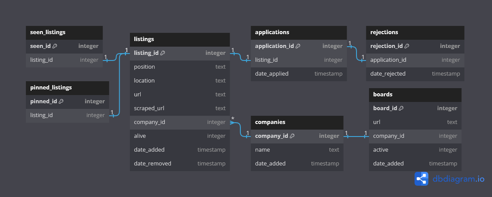

# JobGlob

Python application to make job hunting more efficient.  

JobGlob can
- Scrape 1000+ job boards in as little as a few minutes
- Keep tabs on which listings are still posted
- Only show you listings you haven't already seen
- Track listings you're interested in as well as listings you've applied to

*Current board count*: 1505  
*Active listings*: 40975

## Installation

---
---

If you have `git` installed, clone this repo in a terminal with:
<pre>
git clone https://github.com/matt-manes/jobglob
</pre>

Otherwise click the `<> CODE` button at the top of this repo and click `Download ZIP` from the drop down.  
Once downloaded, extract the contents.  
Open a terminal, navigate to the jobglob directory, and run the `setup.py` script.  
This will install the neccessary dependencies and initialize the database.  

You can verify the setup by invoking the `jobshell.py` script in your terminal and entering the `schema -c` command.  
You should see (numbers may differ):
<pre>
C:\jobglob>jobshell.py
Defaulting to database jobs.db
Starting job_manager (enter help or ? for command info)...
jobs.db>schema -c
Getting database tables...
+-----------------+----------------------------------------------------------------------------------+------------------+
| Table Name      | Columns                                                                          | Number of Rows   |
+=================+==================================================================================+==================+
| companies       | company_id, name, date_added                                                     | 1184             |
+-----------------+----------------------------------------------------------------------------------+------------------+
| boards          | board_id, url, company_id, active, date_added                                    | 1141             |
+-----------------+----------------------------------------------------------------------------------+------------------+
| listings        | listing_id, position, location, url, company_id, alive, date_added, date_removed | 47016            |
+-----------------+----------------------------------------------------------------------------------+------------------+
| seen_listings   | seen_id, listing_id                                                              | 0                |
+-----------------+----------------------------------------------------------------------------------+------------------+
| pinned_listings | pinned_id, listing_id                                                            | 0                |
+-----------------+----------------------------------------------------------------------------------+------------------+
| applications    | application_id, listing_id, date_applied                                         | 0                |
+-----------------+----------------------------------------------------------------------------------+------------------+
| rejections      | rejection_id, application_id, date_rejected                                      | 0                |
+-----------------+----------------------------------------------------------------------------------+------------------+
Getting database views...
+-------------+--------------------------------------------------------------------+------------------+
| View Name   | Columns                                                            | Number of Rows   |
+=============+====================================================================+==================+
| apps        | a_id, l_id, rej, position, company, app_days, rej_days, alive, url | 0                |
+-------------+--------------------------------------------------------------------+------------------+
| pinned      | l_id, a_id, position, company, url, date_added, age_days, alive    | 0                |
+-------------+--------------------------------------------------------------------+------------------+
| scrapers    | b_id, c_id, company, url, active, dob                              | 1141             |
+-------------+--------------------------------------------------------------------+------------------+
| openings    | l_id, c_id, position, location, company, url, alive, days          | 47016            |
+-------------+--------------------------------------------------------------------+------------------+
do_schema execution time: 28ms 922us
jobs.db>
</pre>

*Note: Certain job board types require Selenium to run.  
This means you'll need to have Firefox installed as well as the appropriate [Geckodriver](https://github.com/mozilla/geckodriver/releases) executable.  
The Geckodriver executable should either be placed in the jobglob directory or the location of the executable needs to be added to your environment's PATH.*  

## Basic Usage

---
---

The primary interface for running JobGlob tasks and interacting witht the database
is the `jobshell.py` program mentioned above.  
A list of commands or specific command help can be seen by using the `help` command:

<pre>
jobs.db>help

Common commands (type help <topic>):
====================================
add_scraper  glob          mark_dead      pin_listing  schema
apps         jobglob       mark_rejected  pinned       select
backup       mark_applied  peruse         quit         toggle_scraper

Documented commands (type help <topic>):
========================================
add_column                    glob                schema
add_listing                   help                script
add_scraper                   jobglob             select
add_table                     mark_applied        set_commit_on_close
apps                          mark_dead           set_connection_timeout
backup                        mark_rejected       set_detect_types
company_exists                new_db              set_enforce_foreign_keys
count                         open                size
crawl_company                 peruse              sys
create_scraper_file           pin_listing         tables
customize                     pinned              toggle_scraper
dbpath                        properties          trouble_shoot
delete                        query               try_boards
describe                      quit                update
drop_column                   rename_column       use
drop_table                    rename_table        vacuum
dump                          reset_alive_status  views
flush_log                     restore
generate_peruse_filters_file  scan

Unrecognized commands will be executed as queries.
Use the `query` command explicitly if you don't want to capitalize your key words.
All transactions initiated by commands are committed immediately.

jobs.db>
</pre>

### Scraping

---

To run the JobGlob scraper ad hoc, you can either use the `jobglob` command in the shell, or directly execute the `jobglob.py` file.  
It's recommended to use a VPN in case you start running into rate limiting and IP address blocking issues.  
The output would look something like:

<pre>
Beginning brew
Executing prescrape chores
Loading scrapers
Loaded 1117 scrapers
Starting scrape
runtime:5m [___________________________________________________________]-100.00%
Scrape complete
Executing postscrape chores
Added 32 new listings to the database:
  HeisingSimons Foundation:
    Program Director at United States Artists
  Good Eggs:
    Art Director
  Visier Solutions:
    Business Intelligence Consultant II
  Sysdig:
    Enterprise Account Executive
    Enterprise Account Executive
    Enterprise Account Executive - DC/MD/VA
  Agiloft:
    Enterprise AE
  Starburst:
    Senior GRC Analyst
    Enterprise Account Executive - Bay Area
  Syndio:
    Front End Software Engineer
  Watershed:
    Solutions consultant, strategic
  PlentyofFish:
    Sr. Manager - HR/People
  Thoropass:
    Customer Success Manager/ Account Manager
  CohereHealth:
    Information Systems Specialist
  CapellaSpace:
    RF Electronics Engineer
    NetSuite Administrator
  TysonMendes:
    Associate Attorney
  Moveworks:
    Senior Visual Designer
  Toast:
    Washington District Sales Manager
  Twilio:
    Sr. Manager, Solutions Engineering
  Acumatica:
    Senior Systems Analyst - Project Accounting and Construction
  Flock Safety:
    Associate Salesforce Developer
  EquipmentShare:
    People Systems Manager
    Telematics Installer
  Sony:
    Senior Research Scientist, Next Generation AI/ML Vision & Language
  Zillow:
    Senior Software Development Engineer, iOS - Mexico
    Principal Product Manager - AI Photography - Rich Media Experience Team
    Principal Product Manager - Media Insights
  Leidos:
    SharePoint and Content Delivery Administrator
    Tele-Health Marriage and Family Counselor / Mon-Fri 6am - 2pm
    Tele-Health Licensed Clinical Social Worker LCSW / Mon-Fri 6am - 2pm
    Tele-Health Clinical Psychologist / Mon-Fri 6am - 2pm

redirects:
  onecause
  tcpsoftware

404s:
  trayio
  nautilus_labs
  nzero

parse_fails:
  covestro
  gilead
  trek
  dell
  databricks

misc_fails:
  optm

Total runtime: 5m 18s
Brew complete
</pre>

If you want the scraper to run periodically without manual intervention, execute the `jobglob_daemon.py` script.  
This will run the scrape once an hour Monday through Friday between 7 a.m. and 7 p.m. local tz.

### Searching listings

---

The intended way to look through the scraped listings is by using the `peruse` command within `jobshell` or by directly running the `peruse.py` script.  
Instead of going to a job board and mostly scrolling through listings you've already seen, 
using `peruse` will only show you listings it hasn't previously shown you.  
The simplest usage is to invoke the command followed by key words:

<pre>
C:\jobglob>jobshell.py
Defaulting to database jobs.db
Starting job_manager (enter help or ? for command info)...
jobs.db>peruse python data
Unseen listings: 1055
1/1055
+------+----------------------+-----------+------------+----------------------------+-----------------------------------------------------+
| id   | position             | company   | location   | date                       | url                                                 |
+======+======================+===========+============+============================+=====================================================+
| 1633 | Senior Data Engineer | Attune    | Remote     | 2023-09-27 20:30:42.183613 | https://boards.greenhouse.io/attune/jobs/5570459003 |
+------+----------------------+-----------+------------+----------------------------+-----------------------------------------------------+
Enter action ('a': add to pinned listings, 'd': mark dead, 'o': open url, 'q': quit, 'i' to ignore and mark seen):
</pre>

By entering 'a', 'i', or 'd', this listing will not be shown to you next time you run `peruse`.  

`peruse` has additional arguments that can be used to filter what listings you'll be shown:

<pre>
jobs.db>peruse -h
usage: jobshell.py [-h] [-fl] [-fp] [-ds] [-nf] [key_terms ...]

Look through newly added job listings. If there is no `peruse_filters.toml` file, it will be created. The fields in this file can be used to filter locations and positions by text as well as set up default search terms. All fields are case
insensitive.

positional arguments:
  key_terms             Only show listings with these terms in the job `position`

options:
  -h, --help            show this help message and exit
  -fl, --filter_locations
                        Use `filter_out_location_terms` in `peruse_filters.toml` to filter listings. i.e. any listings with these words in the job `location` won't be shown.
  -fp, --filter_positions
                        Use `filter_out_position_terms` in `peruse_filters.toml` to filter listings. i.e. any listings with these words in the job `position` won't be shown. Overrides `key_terms` arg.
  -ds, --default_search
                        Use `default_search_terms` in `persuse_filters.toml` in addition to any provided `key_terms` arguments.
  -nf, --newest_first   Go through listings starting with the most recent. Default is oldest first.
</pre>

The `-fl`, `-fp`, `-ds` arguments refer to a file that should have just been generated called `peruse_filters.toml`.  
It should look like this:

<pre>
filter_out_position_terms = [
    
]

filter_out_location_terms = [
    
]

default_search_terms = [
    
]
</pre>

The first two can be used to filter out listings and the bottom one can be used to search for listings.  
For example:

<pre>
filter_out_position_terms = [
    "senior",
    "manager"
]

filter_out_location_terms = [
    "alabama",
    "england"
]

default_search_terms = [
    "python",
    "data",
    "backend"
]
</pre>

Now running `peruse -ds -fl -fp` will show listings that contain "python", "data", or "backend", but not if they contain "senior" or "manager".  
Any listings with "alabama" or "england" in the `location` field will also be removed.

<pre>
jobs.db>peruse -ds -fl -fp
Unseen listings: 713
1/713
+------+--------------------+-----------+------------+----------------------------+--------------------------------------------------------------------+
| id   | position           | company   | location   | date                       | url                                                                |
+======+====================+===========+============+============================+====================================================================+
| 2356 | Platform Data Lead | Zerofox   | Bengaluru  | 2023-09-27 20:31:01.268950 | https://jobs.lever.co/zerofox/088c2a60-d859-42d5-b309-c87c3330d2eb |
+------+--------------------+-----------+------------+----------------------------+--------------------------------------------------------------------+
Enter action ('a': add to pinned listings, 'd': mark dead, 'o': open url, 'q': quit, 'i' to ignore and mark seen):
</pre>

Anytime you want to view your pinned listings, simply use the `pinned` command in `jobshell`:

<pre>
jobs.db>pinned
+--------+--------------------------------------------------------------------------+------------------------------+-------------------------------------------------------------------------------------------------------------+------------+---------+
| l_id   | position                                                                 | company                      | url                                                                                                         | age_days   | alive   |
+========+==========================================================================+==============================+=============================================================================================================+============+=========+
| 46388  | Software Engineer I                                                      | Samsara                      | https://boards.greenhouse.io/samsara/jobs/5601538?gh_jid=5601538                                            | 5          | 1       |
+--------+--------------------------------------------------------------------------+------------------------------+-------------------------------------------------------------------------------------------------------------+------------+---------+
| 46857  | Data Engineer                                                            | StackAdapt                   | https://jobs.lever.co/stackadapt/f4fbbb7b-4d54-4dc5-8b84-c2fc9f4ef007                                       | 2          | 1       |
+--------+--------------------------------------------------------------------------+------------------------------+-------------------------------------------------------------------------------------------------------------+------------+---------+
| 50955  | Data Quality Analyst                                                     | Datavant                     | https://datavant.com/jobs/?gh_jid=7068585002                                                                | 1          | 1       |
+--------+--------------------------------------------------------------------------+------------------------------+-------------------------------------------------------------------------------------------------------------+------------+---------+
| 50931  | Software Engineer II, KyruusOne                                          | Kyruus                       | https://jobs.lever.co/kyruushealth/795981ae-7c2c-4bd0-8d2c-f2040ea2276d                                     | 1          | 1       |
+--------+--------------------------------------------------------------------------+------------------------------+-------------------------------------------------------------------------------------------------------------+------------+---------+
| 51679  | Associate Software Engineer                                              | Restaurant365                | https://jobs.lever.co/restaurant365/6eb4f856-2335-4935-b578-2bf46093a1cd                                    | 0          | 1       |
+--------+--------------------------------------------------------------------------+------------------------------+-------------------------------------------------------------------------------------------------------------+------------+---------+
| 51702  | Data Engineer (Remote)                                                   | Path                         | https://jobs.ashbyhq.com/pathmentalhealth/cafb5ba0-c1a9-42ab-90f3-1e8d88258a0d                              | 0          | 1       |
+--------+--------------------------------------------------------------------------+------------------------------+-------------------------------------------------------------------------------------------------------------+------------+---------+
| 51745  | Software Engineer, Backend (Card & Pay Later)                            | Affirm                       | https://boards.greenhouse.io/affirm/jobs/5852399003                                                         | 0          | 1       |
+--------+--------------------------------------------------------------------------+------------------------------+-------------------------------------------------------------------------------------------------------------+------------+---------+
</pre>

To keep track of your applications, use the `mark_applied` command with the `listing_id` of the position you applied for in `jobshell`.  
For example

<pre>
jobs.db>mark_applied 51702
</pre>

would add the second listing from the bottom of the above pinned listings ("Data Engineer (Remote)") to your applications table.  
Similarly to pinned listings, you can view your applications with the `apps` command in `jobshell`:

<pre>
jobs.db>apps
+--------+--------+-------+---------------------------------------------------+---------------+------------+------------+---------+-------------------------------------------------------------------------------------+
| a_id   | l_id   | rej   | position                                          | company       | app_days   | rej_days   | alive   | url                                                                                 |
+========+========+=======+===================================================+===============+============+============+=========+=====================================================================================+
| 97     | 50931  | 0     | Software Engineer II, KyruusOne                   | Kyruus        | 1          |            | 1       | https://jobs.lever.co/kyruushealth/795981ae-7c2c-4bd0-8d2c-f2040ea2276d             |
+--------+--------+-------+---------------------------------------------------+---------------+------------+------------+---------+-------------------------------------------------------------------------------------+
| 98     | 51679  | 0     | Associate Software Engineer                       | Restaurant365 | 0          |            | 1       | https://jobs.lever.co/restaurant365/6eb4f856-2335-4935-b578-2bf46093a1cd            |
+--------+--------+-------+---------------------------------------------------+---------------+------------+------------+---------+-------------------------------------------------------------------------------------+
| 99     | 51702  | 0     | Data Engineer (Remote)                            | Path          | 0          |            | 1       | https://jobs.ashbyhq.com/pathmentalhealth/cafb5ba0-c1a9-42ab-90f3-1e8d88258a0d      |
+--------+--------+-------+---------------------------------------------------+---------------+------------+------------+---------+-------------------------------------------------------------------------------------+
| 100    | 51745  | 0     | Software Engineer, Backend (Card & Pay Later)     | Affirm        | 0          |            | 1       | https://boards.greenhouse.io/affirm/jobs/5852399003                                 |
+--------+--------+-------+---------------------------------------------------+---------------+------------+------------+---------+-------------------------------------------------------------------------------------+
</pre>

*`app_days` is how many days it's been since you applied for that listing*

If you want to track which position's you've been rejected for, use the `mark_rejected` command along with the `application_id` (`a_id` in the above table).

### Checking for dead listings

---

A listing already in the database will be marked dead if it is not found in the scraped listings when a scraper is run.  
This check is skipped if the scraper encountered any parsing errors.  

## Extended Usage

---

### Database reference

---

The database is an SQLite3 database.  
The schema's ERD:

### Adding scrapers

---

Scrapers can be added through `jobshell` using the `add_scraper` command along with the job board url and the name of the company.  
e.g.

<pre>
jobs.db>add_scraper https://globalenergymonitor.bamboohr.com/careers "Global Energy Monitor"
</pre>

would create the necessary database entries and file for the scraper if necessary.  

Generally, no additional code needs to be written for a new scraper if it uses one of the supported 3rd party job boards.  
The current list of supported job boards:
- Greenhouse
- ApplyToJob
- Ashby
- BambooHR
- EasyApply
- Jobvite
- Lever
- Recruitee
- SmartRecruiters
- Workable
- BreezyHR
- Workday
- TeamTailor
- Paycom
- Paylocity
- Dover

Scrapers for job boards not in this list will have a generated file at `./scrapers/{company}.py` that looks like:
<pre>
from pathier import Pathier

root = Pathier(__file__).parent
(root.parent).add_to_PATH()
from typing import Any

from bs4 import Tag

import models
from jobgruel import JobGruel, ParsableItem

class JobScraper(JobGruel):
    def get_parsable_items(self) -> list[ParsableItem]:
        """Get relevant webpages and extract raw data that needs to be parsed.

        e.g. first 10 results for an endpoint that returns json content
        >>> return self.get_page(some_url).json()[:10]"""
        raise NotImplementedError

    def parse_item(self, item: ParsableItem) -> models.Listing | None:
        """Parse `item` and return parsed data.

        e.g.
        >>> try:
        >>>     parsed = {}
        >>>     parsed["thing1"] = item["element"].split()[0]
        >>>     self.successes += 1
        >>>     return parsed
        >>> except Exception:
        >>>     self.logger.exception("message")
        >>>     self.failures += 1
        >>>     return None"""
        raise NotImplementedError

if __name__ == "__main__":
    from datetime import datetime, timedelta

    import helpers

    start = datetime.now() - timedelta(seconds=2)
    j = JobScraper()
    j.scrape()
    print(helpers.load_log(j.board.company.name).filter_dates(start))
</pre>

You will need to implement the `get_parsable_items` and `parse_item` methods.  
Implementation examples can be found in the `jobgruel.py` file.  
The scraper can be tested by directly executing the file or by using the `glob` command in `jobshell`.